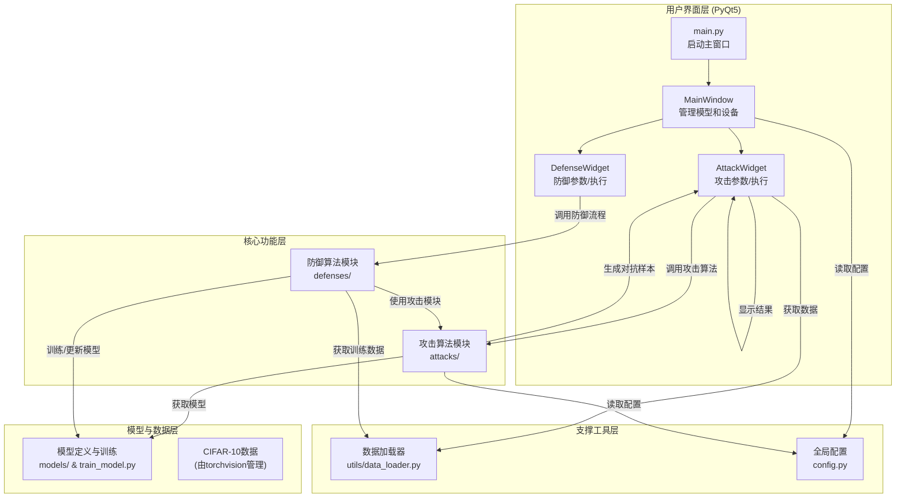

# 对抗攻击与防御演示系统

## 1. 系统概述

本系统是一个基于PyTorch和PyQt5的对抗攻击与防御演示平台，旨在直观展示深度学习模型面对对抗样本的脆弱性以及防御方法的有效性。系统主要功能包括：

- **模型训练**：在CIFAR-10数据集上训练CNN模型
- **对抗攻击**：实现多种经典对抗攻击方法（FGSM、PGD、C&W、JSMA）
- **防御技术**：实现对抗训练、对抗蒸馏等防御方法
- **可视化分析**：提供攻击成功率、扰动强度影响等直观分析
- **友好界面**：基于PyQt5实现的图形用户界面，支持单样本和批量攻击分析

## 2. 系统运行环境与运行方法

### 2.1 运行环境

- **操作系统**：Windows 10/11, Linux,
- **Python版本**：Python 3.8+

### 2.2 运行方法

1. **环境配置**：
   使用 `conda` 创建并激活新的虚拟环境：
   ```bash
   conda create -n adv-demo python=3.10
   conda activate adv-demo
   ```

2. **安装依赖**：
   ```bash
   pip install -r requirements.txt
   ```

3. **演示CNN模型训练**（可选）：
   ```bash
   python train_model.py
   ```

4. **启动主程序**：
   
   ```bash
   python main.py
   ```
   
5. **使用流程**：
   - 在主界面加载预训练模型（或自训练模型）。
   - 进入"攻击分析"模块进行单张图像攻击或批量攻击分析。
   - 进入"防御评估"模块测试防御方法的有效性。

## 3. 算法原理

本节将详细阐述系统中实现的各种对抗攻击算法的原理，并结合代码实现进行分析。

### 3.1 对抗攻击方法

#### 3.1.1 FGSM (Fast Gradient Sign Method)

**原理：**
FGSM 是由 Goodfellow 等人提出的经典攻击算法，其核心思想是：神经网络本质上是一个高度非线性的函数，但其在局部可以被线性近似。因此，通过计算损失函数 $J$ 相对于输入图像 $x$ 的梯度 $\nabla_x J(x, y)$，我们可以找到使损失增长最快的方向。FGSM 沿着这个方向添加一个大小为 $\epsilon$ 的扰动，从而快速生成对抗样本。其数学表达式为：

$$x_{adv} = x + \epsilon \cdot \text{sign}(\nabla_x J(\theta, x, y))$$

其中，$x$ 是原始图像，$y$ 是真实标签，$\theta$ 是模型参数，$\text{sign}(\cdot)$ 函数取梯度的符号（+1 或 -1），$\epsilon$ 是一个超参数，控制扰动的大小，也即攻击的强度。

**代码实现分析 (`attacks/fgsm.py`)：**
在 `FGSM` 类的 `generate` 方法中，我们精确地实现了上述过程。
1.  首先，代码确保输入 `x` 的 `requires_grad` 属性为 `True`，以便计算梯度。
2.  通过 `self.model(x)` 计算模型输出，并与真实标签 `y` 一起送入损失函数 `nn.CrossEntropyLoss()`，得到 `loss`。
3.  调用 `loss.backward()` 计算损失函数关于模型所有参数（包括输入 `x`）的梯度。
4.  通过 `x.grad.data` 获取输入图像的梯度，并使用 `.sign()` 方法获得梯度的符号。
5.  最后，根据公式 `x_adv = x + self.epsilon * sign_data` 生成对抗样本，并通过 `torch.clamp` 函数将像素值限制在 `[0, 1]` 范围内，确保图像的有效性。

```python
# attacks/fgsm.py
# ...
x.requires_grad = True
outputs = self.model(x)
loss = self.criterion(outputs, y)
self.model.zero_grad()
loss.backward()
gradient = x.grad.data
sign_data = gradient.sign()
x_adv = x + self.epsilon * sign_data
x_adv = torch.clamp(x_adv, 0, 1)
# ...
```
`self.epsilon` 参数直接对应公式中的 $\epsilon$，可在 UI 界面中进行调节。

#### 3.1.2 PGD (Projected Gradient Descent)

**原理：**
PGD 可以看作是 FGSM 的迭代版本，它是一种更强大、更通用的攻击方法。与 FGSM 一次性添加一个较大扰动不同，PGD 会进行多步迭代，每步添加一个较小的扰动，然后将生成的样本投影（Projected）回原始样本 $x$ 的 $\epsilon$-邻域内。这使得 PGD 能够更精细地寻找损失函数的局部最大值，从而生成更具欺骗性的对抗样本。其迭代过程可表示为：

$$x^{(t+1)} = \Pi_{B(x, \epsilon)} (x^{(t)} + \alpha \cdot \text{sign}(\nabla_x J(\theta, x^{(t)}, y)))$$

其中，$x^{(0)}$ 通常是原始图像 $x$ 加上一个小的随机扰动。$\alpha$ 是每步的攻击步长，通常小于 $\epsilon$。$\Pi_{B(x, \epsilon)}$ 是一个投影操作，它确保更新后的样本 $x^{(t+1)}$ 始终在以 $x$ 为中心、半径为 $\epsilon$ 的超球体内（通常是 $L_\infty$ 范数定义的超立方体）。

**代码实现分析 (`attacks/pgd.py`)：**
`PGD` 类的 `generate` 方法实现了迭代攻击逻辑。
1.  首先，通过 `x_adv = x.clone().detach()` 创建一个副本。如果 `self.random_start` 为 `True`，则会添加一个在 `[-epsilon, +epsilon]` 范围内的随机扰动作为攻击起点。
2.  进入一个循环，迭代次数由 `self.num_steps` 控制。
3.  在循环内部，与 FGSM 类似，计算损失函数关于当前对抗样本 `x_adv` 的梯度。
4.  使用步长 `self.alpha` 更新对抗样本：`x_adv = x_adv.detach() + self.alpha * grad.sign()`。
5.  关键的投影步骤：通过 `torch.clamp(x_adv - x, min=-self.epsilon, max=self.epsilon)` 计算扰动 `delta`，并将其限制在 $\epsilon$-邻域内。然后将最终的对抗样本像素值也裁剪到 `[0, 1]`。
    
```python
# attacks/pgd.py
# ...
for _ in range(self.num_steps):
    x_adv.requires_grad = True
    outputs = self.model(x_adv)
    loss = self.criterion(outputs, y)
    self.model.zero_grad()
    loss.backward()
    grad = x_adv.grad.data
    # 更新对抗样本
    x_adv = x_adv.detach() + self.alpha * grad.sign()
    # 投影操作
    delta = torch.clamp(x_adv - x, min=-self.epsilon, max=self.epsilon)
    x_adv = torch.clamp(x + delta, 0, 1).detach()
# ...
```
`self.epsilon`, `self.alpha`, 和 `self.num_steps` 三个参数均可在 UI 上设置，提供了灵活的攻击配置。

#### 3.1.3 C&W (Carlini & Wagner)

**原理：**
C&W 攻击是一种基于优化的攻击方法，被公认为是目前最强大的白盒攻击之一。它不直接操作梯度，而是将寻找对抗样本的过程构建为一个优化问题。其目标是找到一个与原始图像 $x$ 差异尽可能小（通常用 L2 范数衡量）的对抗样本 $x_{adv}$，同时又能让模型以高置信度将其错分。其优化目标函数通常形式如下：

$$\min_{\delta} ||\delta||_2^2 + c \cdot f(x+\delta)$$

其中，$\delta = x_{adv} - x$ 是扰动。第一项 $||\delta||_2^2$ 旨在最小化扰动大小。第二项 $f(\cdot)$ 是一个精心设计的目标函数，用于确保攻击成功。$c$ 是一个平衡两项的超参数。函数 $f$ 通常定义为：

$$f(x_{adv}) = \max(\max_{i \neq y} Z(x_{adv})_i - Z(x_{adv})_y, -\kappa)$$

这里 $Z(x_{adv})_i$ 是模型对类别 $i$ 的 logits 输出。该函数的目标是让错误类别中的最高 logits 值比真实类别的 logits 值至少大 $\kappa$。$\kappa$ (kappa) 是置信度参数，$\kappa$ 越大，攻击者对攻击成功的把握就越大。

**代码实现分析 (`attacks/cw.py`)：**
在 `CW` 类的 `generate` 方法中，该优化问题通过 `torch.optim.Adam` 优化器来求解。
1.  首先，定义一个可训练的变量 `w`，它与扰动 `delta` 相关（通过 `torch.atanh` 变换，以保证生成的像素值在 `[0, 1]` 之间）。
2.  在优化循环（由 `self.steps` 控制）中，计算对抗样本 `x_adv`。
3.  计算模型的 logits 输出，并根据真实标签 `y` 分离出真实类别的 logit 和其他类别的 logits。
4.  根据 C&W 的目标函数 $f(x_{adv})$ 计算对抗损失 `loss_adv`，其中 `self.kappa` 对应置信度 $\kappa$。
5.  计算扰动的 L2 范数 `l2_dist`。
6.  总损失 `loss` 由 `l2_dist + self.c * loss_adv` 构成，其中 `self.c` 是平衡常数。
7.  通过 `optimizer.zero_grad()`、`loss.backward()` 和 `optimizer.step()` 执行一步优化，更新 `w`。
8.  循环结束后，返回找到的最佳对抗样本。

```python
# attacks/cw.py
# ...
optimizer = torch.optim.Adam([w], lr=self.lr)
for step in range(self.steps):
    # ... 计算 x_adv ...
    outputs = self.model(x_adv)
    # ... 计算 loss_adv 和 l2_dist ...
    loss = l2_dist + self.c * loss_adv
    optimizer.zero_grad()
    loss.backward()
    optimizer.step()
# ...
```

#### 3.1.4 JSMA (Jacobian-based Saliency Map Attack)

**原理：**
JSMA 是一种与上述方法截然不同的攻击。它不依赖于损失函数的梯度，而是利用模型输出关于输入特征的 **雅可比矩阵** (Jacobian matrix) 来评估每个像素对分类结果的影响力。其核心思想是，每次只修改少量（甚至单个）对分类结果最"敏感"的像素，逐步将样本推向错误分类。这个过程通过构建一个 **显著图 (Saliency Map)** 来实现，图中的值表示修改对应像素能多大程度上增加目标错误类别的概率或降低原始正确类别的概率。

对于无目标攻击，其目标是降低真实类别 $y$ 的概率。显著图可以简化为计算模型对真实类别 $y$ 的输出概率对每个像素的梯度。梯度为正的像素意味着增加其值会增加真实类别的概率，因此我们应该减小它的值来达到攻击目的。

**代码实现分析 (`attacks/jsma.py`)：**
本项目中的 JSMA 实现了一个简化的无目标攻击版本。
1.  在 `generate` 方法的迭代循环（由 `self.max_iter` 控制）中，首先检查当前样本是否已经被错分，如果是则攻击成功并退出。
2.  计算模型对真实类别 `y` 的输出分数 `true_class_score` 对于当前输入 `x_temp` 的梯度。这个梯度可以看作是雅可比矩阵中对应真实类别的那一行，即我们所需要的显著图。
    ```python
    x_temp = x_adv.clone().detach().requires_grad_(True)
    outputs = self.model(x_temp)
    true_class_score = outputs[0, y.item()]
    self.model.zero_grad()
    true_class_score.backward()
    gradients = x_temp.grad.clone()
    ```
3.  为了降低真实类别的概率，我们寻找梯度为正的像素点（即增加其值会增加真实类别概率的点）。然后，将这些点的梯度值作为显著性得分。
4.  代码会屏蔽掉已经修改过的像素，然后从剩余像素中选择显著性得分最高的像素。
5.  对找到的最显著像素，减去一个固定的扰动值 `self.theta`，并通过 `torch.clamp` 保证像素值有效。
6.  重复此过程，直到攻击成功或达到最大迭代次数。

这种方法精准地修改少量像素，因此扰动通常在视觉上难以察觉，但计算开销相对较大。

### 3.2 防御方法

#### 3.2.1 对抗训练

**原理：**
对抗训练是目前最有效、最直接的防御方法之一。其核心思想是在模型的训练过程中，不仅使用干净的原始样本，还加入由攻击算法生成的对抗样本。这样，模型在学习分类的同时，也学会了识别和抵抗这些微小的恶意扰动，从而提升其鲁棒性。其优化目标可以看作一个 min-max 问题：

$$\min_\theta \mathbb{E}_{(x,y) \sim D} \left[ \max_{\delta \in S} L(\theta, x+\delta, y) \right]$$

内层的 `max` 表示对于给定的模型参数 $\theta$，通过攻击算法（如 PGD）找到在扰动预算 $S$ 内使损失函数 $L$ 最大的扰动 $\delta$（即生成对抗样本）。外层的 `min` 表示更新模型参数 $\theta$ 以最小化在这些"最坏情况"下的损失。通过这种方式，模型的决策边界会变得更加平滑和稳健。

## 4. 系统实现

本系统采用分层和模块化的设计思想，将用户界面、核心算法和数据模型进行解耦，以提高代码的可维护性和扩展性。

项目的整体目录结构如下：

```
adversarial-defense/
├── main.py                 # 主程序入口
├── config.py               # 全局配置文件
├── train_model.py          # 独立模型训练脚本
├── requirements.txt        # 依赖库
├── report.md               # 技术报告
├── attacks/                # 攻击算法模块
│   ├── __init__.py
│   ├── fgsm.py
│   ├── pgd.py
│   ├── cw.py
│   └── jsma.py
├── defenses/               # 防御算法模块
│   ├── __init__.py
│   └── adversarial_training.py
├── models/                 # 模型定义模块
│   └── cnn_model.py
├── ui/                     # 用户界面模块
│   ├── __init__.py
│   ├── main_window.py
│   ├── attack_widget.py
│   └── defense_widget.py
└── utils/                  # 工具类模块
    ├── __init__.py
    └── data_loader.py
```

### 4.1 总体架构

系统架构可分为四个主要层次：用户界面层 (UI Layer)、核心功能层 (Core Logic Layer)、模型与数据层 (Model & Data Layer) 以及支撑工具层 (Utility Layer)。



**逻辑关系说明：**

1.  **启动流程**：程序入口为 `main.py`，它负责初始化 Qt 应用并启动主窗口 `MainWindow`。`MainWindow` 是整个应用的枢纽，负责加载模型、管理设备（CPU/GPU），并作为 `AttackWidget` 和 `DefenseWidget` 的容器。
2.  **攻击流程**：用户在 `AttackWidget` 中选择攻击方法并设置参数，点击"执行攻击"后，`AttackWidget` 会：
    *   从 `MainWindow` 获取当前加载的深度学习模型。
    *   通过 `utils.data_loader` 获取测试图像。
    *   实例化 `attacks/` 目录下对应的攻击类（如 `FGSM`）。
    *   调用该实例的 `generate` 方法，传入模型和数据，执行攻击并返回对抗样本。
    *   最后，`AttackWidget` 使用 Matplotlib 将原始图像、扰动和对抗样本可视化。
3.  **防御流程**：用户在 `DefenseWidget` 中配置防御参数（如对抗训练的迭代次数），启动防御流程后，`DefenseWidget` 会：
    *   调用 `defenses/` 目录下的相应防御模块（如 `AdversarialTraining`）。
    *   防御模块在训练循环中，会反向调用 `attacks/` 模块来实时生成对抗样本，并将其用于模型训练。
    *   训练完成后，更新后的模型可以被保存或直接用于后续的攻击评估。

### 4.2 关键模块实现

#### 4.2.1 用户界面模块 (`ui/`)

- **`main_window.py`**: 作为程序的主框架，采用 `QTabWidget` 将攻击和防御功能分离到不同的标签页，使得界面清晰、功能独立。它还负责统一的模型加载和设备选择逻辑，为子模块提供必要的上下文信息。
- **`attack_widget.py`**: 负责所有与攻击相关的交互。它动态地根据用户选择的攻击方法（如 FGSM, PGD）显示不同的参数设置面板。该模块是连接用户操作和后端攻击算法的桥梁。
- **`defense_widget.py`**: 负责防御流程的控制，允许用户配置对抗训练等参数，并展示防御训练的进度和结果。

#### 4.2.2 核心算法模块 (`attacks/` 和 `defenses/`)

- **`attacks/`**: 目录下的每个文件（如 `fgsm.py`, `cw.py`）都实现了一种攻击算法。这些算法被设计为独立的类，并遵循统一的接口，即都包含一个 `generate(self, x, y)` 方法。这种设计使得 `AttackWidget` 可以用一致的方式调用不同的攻击，实现了界面与算法的解耦。
- **`defenses/`**: 实现了防御算法。例如，`adversarial_training.py` 包含一个训练循环，该循环在每个训练步中都会实例化一个攻击器（如 `PGD`）来生成对抗样本，并将其与原始样本混合后送入模型进行训练。

#### 4.2.3 模型与配置模块 (`models/`, `config.py`)

- **`models/`**: 存放模型定义文件，如 `cnn_model.py` 定义了本系统使用的卷积神经网络结构。`train_model.py` 则提供了独立的模型训练脚本，用于生成预训练模型。
- **`config.py`**: 全局配置文件，集中管理了模型超参数、攻击参数默认值、数据集路径等常量。这使得参数调整非常方便，避免了在代码中硬编码"魔术数字"，提升了代码的可配置性。

#### 4.2.4 数据处理模块 (`utils/`)

- **`data_loader.py`**: 封装了 `torchvision` 对 CIFAR-10 数据集的加载、预处理（归一化、张量转换）和批量化操作。它为系统的其他部分提供了简单、一致的数据接口，无论是获取单张测试图像还是整个训练数据集。

## 5. 效果展示

### 5.1 主界面与模型加载

运行

```shell
python main.py
```

即可进入主界面


主界面包含对抗攻击与对抗防御两大模块，另外在“文件”选项中可以加载已经训练好的模型文件，作为攻击的对象。


### 5.2 攻击模块

攻击模块包含**“单张图像攻击”**和**“批量攻击分析”**两大板块。

#### 5.2.1 单张图像攻击

对于单张图像，可以点击“加载测试图像”，系统会从CIFAR-10测试集中随机选取一张图片。

选择攻击方法（共有四种攻击方法），调整扰动强度，点击执行攻击，即可对单张图像执行对抗攻击。可视化效果如下：


#### 5.2.2 批量图像攻击

在批量攻击模块，主要有两个维度的分析：

1. 不同对抗攻击方法成功率对比

   

   测试了在100张测试图像上各种攻击方法的攻击成功率（JSMA算法评估指标不同，没有一起比较），可以发现攻击成功率PGD>FGSM>CW。

2. 不同扰动强度分析

   对FGSM和PGD两种算法进行不同扰动强度分析，结果如下：

   

   可以看到随着扰动强度上升，两种算法的攻击成功率均有所上升，其中PGD算法上升更加显著。

### 5.3 防御模块

主要采用对抗训练的方法进行对抗防御：


使用未经过对抗训练和经过对抗训练过后的模型，重新进行攻击测试，对比结果如图：


可以发现**攻击成功率从58.6%降到了23.6%**，这也说明了我们对抗训练的有效性。

在不同扰动强度下测试经过对抗训练过的模型：


可以发现随着扰动强度上升，FGSM攻击成功率上升不显著，但是PGD攻击成功率显著上升。**这主要是因为我们的模型是在FGSM攻击下的数据集上做的对抗训练，自然对于FGSM攻击的抵御效果强，而对于PGD的鲁棒性有限**。但是和没有经过对抗训练相比，仍然使得攻击**成功率下降了约20%**。说明我们的对抗训练的方法有一定的泛化能力。

## 6. 总结与展望

本系统成功实现了主流对抗攻击与防御方法的可视化演示，为深度学习安全性研究提供了直观的实验平台。主要贡献包括：

1. **全面的攻击实现**：集成了从基础的FGSM到复杂的C&W等多种攻击方法
2. **实用的防御技术**：实现了对抗训练、对抗蒸馏等防御方法
3. **友好的用户界面**：提供了直观的可视化界面，降低了实验门槛
4. **灵活的扩展性**：模块化设计便于集成新的攻击和防御方法

### 未来工作方向：

1. **支持更多模型架构**：扩展到ResNet、EfficientNet等更复杂网络
2. **增加新型攻击方法**：实现AutoAttack、Square Attack等最新攻击
3. **强化防御能力**：集成随机化防御、特征压缩等先进防御方法
4. **跨领域应用**：扩展到目标检测、语义分割等更广泛任务
